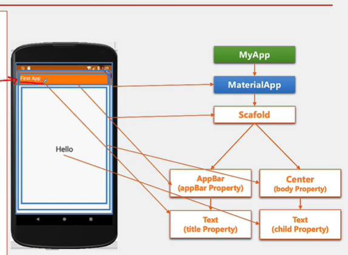

# 📱 Flutter — Mes Notes d'Apprentissage

---

## 🔵 C'est quoi Flutter ?

**Flutter** est un framework de développement **mobile** (et aussi web/desktop) créé par **Google**.  
Il est basé sur le langage **Dart**, un langage créé par Google à la base pour remplacer JavaScript — mais Dart est resté peu utilisé jusqu'à la création de Flutter, qui lui a donné une vraie utilité.

> ✅ **Avantage principal** : un seul code source → app Android + iOS + Web + Desktop.

---

## 🛠️ Éditeurs supportés

On peut utiliser Flutter avec :
- **Android Studio** → [Tuto vidéo](https://www.youtube.com/watch?v=DvAq5dKN5uk&list=PLzFUEeWdXH-0xB7f8dxMCcwZKIdLaLMRL)
- **VS Code** → [Tuto vidéo](https://www.youtube.com/watch?v=DZoXID80NiE&t=309s)

> ℹ️ **Angular Dart** existe aussi pour le mobile mais il est peu utilisé. Flutter est la vraie solution de Google.

---

## ⚙️ Les 2 types de compilation

| Mode | Nom complet | Quand ? | Ce que ça fait |
|------|-------------|---------|----------------|
| **JIT** | Just In Time | Pendant le développement | Compile le code **au moment de l'exécution**. Permet le **Hot Reload** (voir les changements instantanément sans redémarrer). |
| **AOT** | Ahead Of Time | Pour la production (publication) | Compile **tout le code avant l'exécution** en binaire natif optimisé. L'app est plus rapide. |

> 💡 Tu n'as rien à choisir manuellement. Flutter utilise JIT quand tu développes, et AOT quand tu fais `flutter build` pour publier.

---

## 🧱 Structure d'une app Flutter

```
MyApp
  └── MaterialApp          ← composant racine (navigation, thème, structure globale)
        └── Scaffold       ← structure visuelle d'UNE page
              ├── AppBar   ← barre du haut (titre, boutons...)
              ├── Drawer   ← menu latéral (navigation)
              │     └── ListView
              │           ├── DrawerHeader
              │           └── ListTile  (x N pages)
              ├── body     ← contenu principal
              └── floatingActionButton
```

---

## 🎨 MaterialApp — le composant racine

`MaterialApp` est le **widget racine obligatoire** de toute app Flutter. Il gère la navigation, le thème et la structure globale basée sur le **Material Design** de Google.

### Attributs principaux

| Attribut | Rôle |
|----------|------|
| `title` | Nom de l'app (affiché dans le gestionnaire de tâches du téléphone) |
| `theme` | Palette de couleurs et typographie globale |
| `home` | Premier écran affiché au démarrage |
| `routes` | Table de navigation : associe un chemin (`"/meteo"`) à une page |
| `initialRoute` | Route lancée par défaut au démarrage — **remplace `home:`** |
| `debugShowCheckedModeBanner` | Mettre `false` pour cacher la bannière rouge "DEBUG" |

> ⚠️ **Ne jamais utiliser `home:` et `initialRoute:` ensemble** — ils font la même chose. Choisis l'un ou l'autre.

### Exemple complet

```dart
return MaterialApp(
  title: "Mon App",
  theme: ThemeData(
    useMaterial3: false,        // utilise Material Design 2
    primarySwatch: Colors.pink, // couleur principale de l'app
  ),
  routes: {
    "/"        : (context) => HomePage(),
    "/home"    : (context) => HomePage(),
    "/meteo"   : (context) => MeteoPage(),
    "/counter" : (context) => CounterPage(),
    "/gallery" : (context) => GalleryPage(),
  },
  initialRoute: "/",
  // home: HomePage(), ← NE PAS mettre les deux !
);
```

### Utiliser le thème dans un widget

```dart
// Au lieu d'écrire TextStyle manuellement, utilise le thème global :
style: Theme.of(context).textTheme.headlineMedium
style: Theme.of(context).textTheme.bodyLarge
```

---

## 🏗️ Scaffold — structure d'une page

`Scaffold` organise visuellement **une page**. Il se place à l'intérieur de chaque page (pas dans `MaterialApp`).

| Attribut | Rôle |
|----------|------|
| `appBar` | Barre du haut avec titre et boutons |
| `body` | Contenu principal de la page |
| `drawer` | Menu de navigation latéral (glisse depuis la gauche) |
| `floatingActionButton` | Bouton(s) flottant(s) en bas à droite |

```dart
return Scaffold(
  appBar: AppBar(
    title: Text("Ma Page"),
    backgroundColor: Colors.blueGrey,
  ),
  drawer: MyDrawer(), // widget Drawer séparé
  body: Center(
    child: Text("Contenu ici"),
  ),
);
```

---

## 🧭 Drawer — menu de navigation latéral

Structure typique d'un `Drawer` :

```dart
Drawer(
  child: ListView(
    padding: EdgeInsets.zero, // colle le header tout en haut sans espace
    children: [
      DrawerHeader(
        decoration: BoxDecoration(
          gradient: LinearGradient(colors: [
            Colors.white,
            Colors.green,
            Colors.greenAccent,
            Colors.lightGreenAccent,
          ]),
        ),
        child: Center(
          child: CircleAvatar(
            backgroundImage: AssetImage("images/avatar.jpg"),
            radius: 30,
          ),
        ),
      ),
      ListTile(
        title: Text("Home", style: TextStyle(fontSize: 22)),
        leading: Icon(Icons.home, color: Colors.orange),
        trailing: Icon(Icons.home_max_outlined, color: Colors.blueGrey),
        onTap: () {
          Navigator.of(context).pop();            // 1. ferme le drawer
          Navigator.pushNamed(context, '/home');  // 2. navigue vers la page
        },
      ),
      Divider(height: 3, color: Colors.blueGrey), // séparateur entre items
    ],
  ),
)
```

> ⚠️ **Toujours faire `Navigator.of(context).pop()` AVANT `pushNamed()`** depuis un Drawer, sinon le menu reste ouvert par-dessus la nouvelle page.

Chaque `ListTile` peut avoir :

| Attribut | Rôle |
|----------|------|
| `title` | Texte principal |
| `leading` | Icône à gauche |
| `trailing` | Icône à droite |
| `onTap` | Action au clic |

---

## 🟢 StatelessWidget vs StatefulWidget

C'est un concept **très important** en Flutter.

### StatelessWidget

- Se recharge uniquement si ses **données externes** changent
- **Ne peut pas** se mettre à jour à partir de données internes dynamiques
- ✅ Utilise-le pour les pages fixes et les composants statiques

```dart
class MaPage extends StatelessWidget {
  @override
  Widget build(BuildContext context) {
    return Text("Je ne change jamais seul");
  }
}
```

### StatefulWidget

- Se recharge quand les données **internes OU externes** changent
- Utilise `setState()` pour déclencher le rechargement de l'affichage
- ✅ Utilise-le quand des données changent dynamiquement (compteur, formulaire...)

```dart
class CounterPage extends StatefulWidget {
  @override
  State<CounterPage> createState() => _CounterPageState();
}

class _CounterPageState extends State<CounterPage> {
  int counter = 0; // variable d'état interne

  @override
  Widget build(BuildContext context) {
    return Text("$counter"); // se met à jour à chaque setState()
  }
}
```

### Tableau récapitulatif

| | StatelessWidget | StatefulWidget |
|--|--|--|
| Données **externes** changent | ✅ Se recharge | ✅ Se recharge |
| Données **internes** changent | ❌ Ne se recharge pas | ✅ Se recharge avec `setState()` |
| Utilisation | Pages fixes | Pages dynamiques |

> 💡 **Le `_` devant un nom** (ex: `_CounterPageState`) signifie que la classe est **privée** au fichier en Dart.

> 🔮 **State Management** (Provider, Riverpod, Bloc...) : dans une vraie app, on utilise des outils de gestion d'état pour éviter d'abuser de `StatefulWidget`. C'est une étape future.

---

## 🔁 setState() — mettre à jour l'affichage

```dart
FloatingActionButton(
  onPressed: () {
    setState(() {
      // setState() réexécute build() automatiquement
      counter++;
    });
  },
  child: Icon(Icons.add),
)
```

> ⚠️ `setState()` ne fonctionne que dans un `StatefulWidget`. Sans lui, l'affichage ne se met pas à jour même si la variable change.

---

## 🔄 Navigation entre pages

```dart
// Aller vers une page
Navigator.pushNamed(context, '/meteo');

// Revenir à la page précédente
Navigator.of(context).pop();

// Depuis un Drawer — toujours pop() AVANT pushNamed()
onTap: () {
  Navigator.of(context).pop();           // 1. ferme le menu
  Navigator.pushNamed(context, '/home'); // 2. navigue
}
```

---

## 📦 Ajouter des images

Dans `pubspec.yaml`, déclare tes images — **l'indentation est obligatoire** :

```yaml
flutter:
  assets:
    - images/logo.png
    - images/avatar.jpg
```

> ⚠️ Après avoir modifié `pubspec.yaml`, lance **flutter pub get** (ou clique sur "Pub Get" dans l'IDE).

```dart
// Afficher une image
Image.asset("images/logo.png")

// Dans un CircleAvatar
CircleAvatar(
  backgroundImage: AssetImage("images/avatar.jpg"),
  radius: 30,
)
```

---

## 🔘 Plusieurs FloatingActionButtons

```dart
// Un seul bouton
floatingActionButton: FloatingActionButton(
  onPressed: () { /* action */ },
  child: Icon(Icons.add),
),

// Plusieurs boutons dans une Row
floatingActionButton: Row(
  mainAxisAlignment: MainAxisAlignment.end, // aligne à droite
  children: [
    FloatingActionButton(onPressed: () { setState(() { counter--; }); }, child: Icon(Icons.remove)),
    SizedBox(width: 10), // espace entre les deux boutons
    FloatingActionButton(onPressed: () { setState(() { counter++; }); }, child: Icon(Icons.add)),
  ],
),
```

---

## 🎨 Widgets utiles — référence rapide

```dart
// Centrer un widget
Center(child: Text("centré"))

// Espace entre deux widgets
SizedBox(width: 10)   // espace horizontal
SizedBox(height: 10)  // espace vertical

// Supprimer le padding par défaut d'une ListView
ListView(padding: EdgeInsets.zero, children: [...])

// Aligner les enfants à la fin (droite ou bas)
Row(mainAxisAlignment: MainAxisAlignment.end, children: [...])

// Séparateur dans une liste
Divider(height: 3, color: Colors.blueGrey)

// Dégradé dans un DrawerHeader
decoration: BoxDecoration(
  gradient: LinearGradient(colors: [
    Colors.white,
    Colors.green,
    Colors.greenAccent,
    Colors.lightGreenAccent,
  ]),
)
```

---

## ✅ Résumé — ce qu'il faut retenir

| Concept | À retenir |
|---------|-----------|
| `MaterialApp` | Widget racine — gère thème, navigation, structure globale |
| `Scaffold` | Structure d'UNE page — appBar, body, drawer, FAB |
| `StatelessWidget` | Pas d'état interne — données fixes |
| `StatefulWidget` | État interne dynamique — utilise `setState()` |
| `setState()` | Force Flutter à réexécuter `build()` |
| `initialRoute` | Remplace `home:` — ne pas utiliser les deux |
| `Navigator.pop()` | Toujours avant `pushNamed()` depuis un Drawer |
| `_` devant un nom | Signifie **privé** en Dart |


====================================================================================================

# 📱 Flutter — Mes Notes d'Apprentissage

---

## 🔵 C'est quoi Flutter ?

**Flutter** est un framework de développement **mobile** (et aussi web/desktop) créé par **Google**.  
Il est basé sur le langage **Dart**, un langage créé par Google à la base pour remplacer JavaScript — mais Dart est resté peu utilisé jusqu'à la création de Flutter, qui lui a donné une vraie utilité.

> ✅ Flutter permet de créer une seule application qui tourne sur Android, iOS, Web et Desktop à partir d'un seul code source.

---

## 🛠️ Installation — Éditeurs supportés

On peut utiliser Flutter avec :
- **Android Studio** → [Tuto vidéo Android Studio](https://www.youtube.com/watch?v=DvAq5dKN5uk&list=PLzFUEeWdXH-0xB7f8dxMCcwZKIdLaLMRL)
- **VS Code** → [Tuto vidéo VS Code](https://www.youtube.com/watch?v=DZoXID80NiE&t=309s)

> ⚠️ **Angular Dart** existe aussi pour le développement mobile, mais Flutter est bien plus populaire et maintenu.

---

## ⚙️ Les deux types de compilation Flutter

| Type | Nom complet | Utilisation | Explication |
|------|------------|-------------|-------------|
| **JIT** | Just In Time | Développement | Compile le code **ligne par ligne à l'exécution**. Permet le **Hot Reload** (rechargement rapide pendant le dev). |
| **AOT** | Ahead Of Time | Production | Compile **tout le code avant l'exécution** (en binaire natif). L'app est plus rapide et optimisée. |

> 💡 En développement tu utilises JIT. Quand tu publies ton app, Flutter utilise AOT automatiquement.

---

## 🧱 Structure d'une application Flutter

Une app Flutter suit cette hiérarchie :

```
MyApp
  └── MaterialApp          ← composant racine (gère navigation, thème, style Material Design)
        └── Scaffold       ← structure visuelle d'une page
              ├── AppBar   ← barre du haut (titre, boutons...)
              ├── Drawer   ← menu latéral (navigation)
              │     └── ListView
              │           ├── DrawerHeader
              │           └── ListTile (x N)
              └── body     ← contenu principal de la page
```

---

## 🎨 MaterialApp — Le composant racine

`MaterialApp` est le **widget racine indispensable** dans toute app Flutter. Il initialise le système **Material Design** de Google (le style visuel par défaut sur Android).

### Principaux attributs

| Attribut | Rôle |
|----------|------|
| `title` | Nom de l'app (affiché dans le gestionnaire de tâches) |
| `theme` | Palette de couleurs et typographie de l'app |
| `home` | Premier écran affiché au lancement |
| `routes` | Table de routage (association chemin → page) |
| `initialRoute` | Route lancée par défaut au démarrage |
| `debugShowCheckedModeBanner` | Masquer la bannière rouge "DEBUG" (`false` pour la cacher) |

> ⚠️ Si tu utilises `initialRoute`, tu n'as **pas besoin** de `home` — les deux font la même chose, ne les mets pas ensemble.

### Exemple de thème

```dart
theme: ThemeData(
  useMaterial3: false,         // utilise Material Design 2
  primarySwatch: Colors.pink,  // couleur principale de l'app
),
```

### Exemple de routes

```dart
routes: {
  "/"       : (context) => HomePage(),
  "/home"   : (context) => HomePage(),
  "/meteo"  : (context) => MeteoPage(),
  "/counter": (context) => CounterPage(),
  "/galley" : (context) => GalleryPage(),
},
initialRoute: "/",
```

---

## 🏗️ Scaffold — La structure d'une page

`Scaffold` organise visuellement une page Flutter. Il contient :

| Attribut | Rôle |
|----------|------|
| `appBar` | Barre du haut avec titre |
| `body` | Contenu principal de la page |
| `drawer` | Menu latéral (navigation) |
| `floatingActionButton` | Bouton flottant (action principale) |

### Exemple de base

```dart
return Scaffold(
  appBar: AppBar(title: Text("Ma Page")),
  body: Center(child: Text("Contenu ici")),
  drawer: MyDrawer(),
);
```

---

## 🟢 StatelessWidget vs StatefulWidget

C'est un concept **très important** en Flutter.

### StatelessWidget 🔴

- Le widget est **statique** — il ne se recharge **que si ses données externes changent**
- Il **ne peut pas** se mettre à jour à partir de données internes dynamiques
- ✅ Utilise-le pour les pages simples, les composants qui ne changent pas

```dart
class MaPage extends StatelessWidget {
  @override
  Widget build(BuildContext context) {
    return Text("Je ne change jamais seul");
  }
}
```

### StatefulWidget 🟢

- Le widget **peut se recharger** à chaque changement d'état, interne **ou** externe
- Il utilise `setState()` pour signaler un changement → Flutter réexécute `build()`
- ✅ Utilise-le quand des données changent dynamiquement (compteur, formulaire...)

```dart
class CounterPage extends StatefulWidget {
  @override
  State<CounterPage> createState() => _CounterPageState();
}

class _CounterPageState extends State<CounterPage> {
  int counter = 0; // état interne

  @override
  Widget build(BuildContext context) {
    return Text("$counter");
  }
}
```

> 💡 **Le `_` devant un nom** (ex: `_CounterPageState`) signifie que la classe est **privée** au fichier en Dart.

### Tableau récapitulatif

| | StatelessWidget | StatefulWidget |
|--|--|--|
| Données externes changent | ✅ Se recharge | ✅ Se recharge |
| Données internes changent | ❌ Ne se recharge pas | ✅ Se recharge avec `setState()` |
| Utilisation | Pages fixes | Pages dynamiques |

> 🔮 **State Management** (ex: Provider, Riverpod, Bloc) : dans de vraies apps, on utilise des solutions de gestion d'état pour éviter d'utiliser `StatefulWidget` partout. On en parlera plus tard.

---

## 🔄 Navigation entre pages

Flutter utilise un système de **routes nommées** pour naviguer entre les pages.

```dart
// Aller vers une page
Navigator.pushNamed(context, '/meteo');

// Fermer le drawer avant de naviguer (bonne pratique !)
Navigator.of(context).pop();
Navigator.pushNamed(context, '/home');
```

> ⚠️ Toujours faire `pop()` avant `pushNamed()` depuis un Drawer, sinon le menu reste ouvert par-dessus la nouvelle page.

---

## 📦 Ajouter des images

Dans le fichier `pubspec.yaml`, déclare tes images comme ceci :

```yaml
flutter:
  assets:
    - images/logo.png
    - images/avatar.jpg
```

> ⚠️ **Indentation importante !** Les espaces doivent être respectés dans `pubspec.yaml`.  
> Après avoir modifié le fichier, lance **"Pub Get"** (ou `flutter pub get` en terminal).

Utilisation dans le code :
```dart
Image.asset("images/logo.png")
// ou dans un CircleAvatar :
CircleAvatar(backgroundImage: AssetImage("images/avatar.jpg"), radius: 30)
```

---

## 🎨 Widgets utiles — Récapitulatif

### Mise en page

```dart
// Centrer un élément
Center(child: Text("centré"))

// Aligner les enfants à la fin (droite/bas)
Row(mainAxisAlignment: MainAxisAlignment.end, children: [...])
Column(mainAxisAlignment: MainAxisAlignment.end, children: [...])

// Espace entre deux widgets (ex: entre deux boutons)
SizedBox(width: 10)  // espace horizontal
SizedBox(height: 10) // espace vertical

// Padding dans une ListView
ListView(padding: EdgeInsets.zero, children: [...])
```

### Style de texte avec le thème global

```dart
// Utiliser le style du thème au lieu de TextStyle manuel
style: Theme.of(context).textTheme.headlineMedium
style: Theme.of(context).textTheme.bodyLarge
```

### Séparateur dans une liste

```dart
Divider(height: 3, color: Colors.blueGrey)
```

### Dégradé dans un DrawerHeader

```dart
decoration: BoxDecoration(
  gradient: LinearGradient(colors: [
    Colors.white,
    Colors.green,
    Colors.greenAccent,
    Colors.lightGreenAccent,
  ]),
),
```

---

## 🧭 Drawer — Menu de navigation latéral

Structure typique d'un `Drawer` :

```dart
Drawer(
  child: ListView(
    padding: EdgeInsets.zero, // ← important pour coller le header en haut
    children: [
      DrawerHeader(...),    // ← en-tête avec avatar/image
      ListTile(...),        // ← item de navigation
      Divider(...),         // ← séparateur visuel
      ListTile(...),
      Divider(...),
    ],
  ),
)
```

Chaque `ListTile` peut avoir :
- `title` → texte principal
- `leading` → icône à gauche
- `trailing` → icône à droite
- `onTap` → action au clic

---

## 🔘 FloatingActionButton — Boutons flottants

**Un seul bouton :**
```dart
floatingActionButton: FloatingActionButton(
  onPressed: () { /* action */ },
  child: Icon(Icons.add),
),
```

**Plusieurs boutons** (dans une `Row` avec espacement) :
```dart
floatingActionButton: Row(
  mainAxisAlignment: MainAxisAlignment.end, // aligner à droite
  children: [
    FloatingActionButton(onPressed: () {...}, child: Icon(Icons.remove)),
    SizedBox(width: 10), // espace entre les deux boutons
    FloatingActionButton(onPressed: () {...}, child: Icon(Icons.add)),
  ],
),
```

---

## 🔁 setState() — Mettre à jour l'affichage

```dart
setState(() {
  counter++; // modifie la variable
  // Flutter réexécute build() automatiquement
});
```

> ⚠️ `setState()` ne fonctionne que dans un `StatefulWidget`. Il **force la réexécution de `build()`** pour mettre à jour l'affichage.

---

---

# 📝 Partie supplémentaire — Analyse de tes fichiers de code

## `main.dart` — Point d'entrée de l'application

```dart
void main() => runApp(MyApp());
```

`MyApp` est un `StatelessWidget` car elle ne fait que configurer le `MaterialApp` — aucun état dynamique nécessaire.

**Ce que fait ton `MaterialApp` :**
- Définit un thème rose (`Colors.pink`) avec Material Design 2 (`useMaterial3: false`)
- Définit 5 routes nommées (`/`, `/home`, `/meteo`, `/counter`, `/galley`)
- `initialRoute: "/"` démarre sur `HomePage` — `home:` est commenté, c'est correct, les deux ne doivent pas coexister

> ⚠️ Petite faute de frappe : la route `/galley` devrait probablement être `/gallery` pour être cohérente avec le nom de la page `GalleryPage`.

---

## `drawer.widget.dart` — Composant de navigation

Ton `MyDrawer` est un `StatelessWidget` réutilisable — bonne pratique de le séparer dans son propre fichier.

**Points notables :**
- Le `DrawerHeader` utilise un dégradé vert avec un `CircleAvatar` centré — bel effet visuel
- Chaque `ListTile` fait d'abord `Navigator.of(context).pop()` pour fermer le drawer avant de naviguer — **c'est la bonne approche**
- Les `Divider` entre chaque item améliorent la lisibilité

> 💡 Le widget `Drawer` doit être passé dans l'attribut `drawer:` du `Scaffold` de chaque page (comme tu le fais dans `home.page.dart`).

---

## `counter.page.dart` — Page avec état dynamique

C'est ta seule page `StatefulWidget` — et elle illustre parfaitement le concept.

```dart
class CounterPage extends StatefulWidget {
  @override
  State<CounterPage> createState() => _CounterPageState();
}

class _CounterPageState extends State<CounterPage> {
  int counter = 0; // ← variable d'état interne (privée au widget)
  ...
}
```

**Ce qui se passe :**
1. `counter` est une variable d'état interne
2. Les deux `FloatingActionButton` (+ et -) appellent `setState(() { counter++; })` ou `setState(() { counter--; })`
3. À chaque appel de `setState()`, Flutter réexécute `build()` et l'affichage se met à jour

> ⚠️ Le `Text` affiche `counter + 1` : `"Conter Value:=> ${counter+1}"` — si tu veux afficher la vraie valeur du compteur, utilise juste `$counter`.

> 💡 Les commentaires dans le code (`//bx myt3tlx...`) sont en arabe dialectal marocain — c'est tout à fait valide pour tes notes personnelles ! Mais pour un projet partagé, préfère l'anglais ou le français pour les commentaires.

---

## `home.page.dart`, `meteo.page.dart`, `gallery.page.dart` — Pages simples

Ces trois pages sont des `StatelessWidget` correctement structurées avec `Scaffold`.

- `HomePage` intègre ton `MyDrawer` et utilise `Theme.of(context).textTheme.headlineMedium` pour le style — bonne pratique
- `MeteoPage` et `GalleryPage` ont des `AppBar` mais pas encore de contenu dans le `body` — à compléter
- `GalleryPage` utilise `Theme.of(context).textTheme.bodyLarge` pour le style du titre de l'AppBar

---

## ✅ Points forts de ton code

- ✅ Bonne séparation des fichiers (`pages/`, `widgets/`)
- ✅ Utilisation des routes nommées (`pushNamed`)
- ✅ Drawer réutilisable en widget séparé
- ✅ `pop()` avant navigation depuis le Drawer
- ✅ `setState()` bien utilisé dans `CounterPage`
- ✅ Utilisation du thème global (`Theme.of(context)`)

